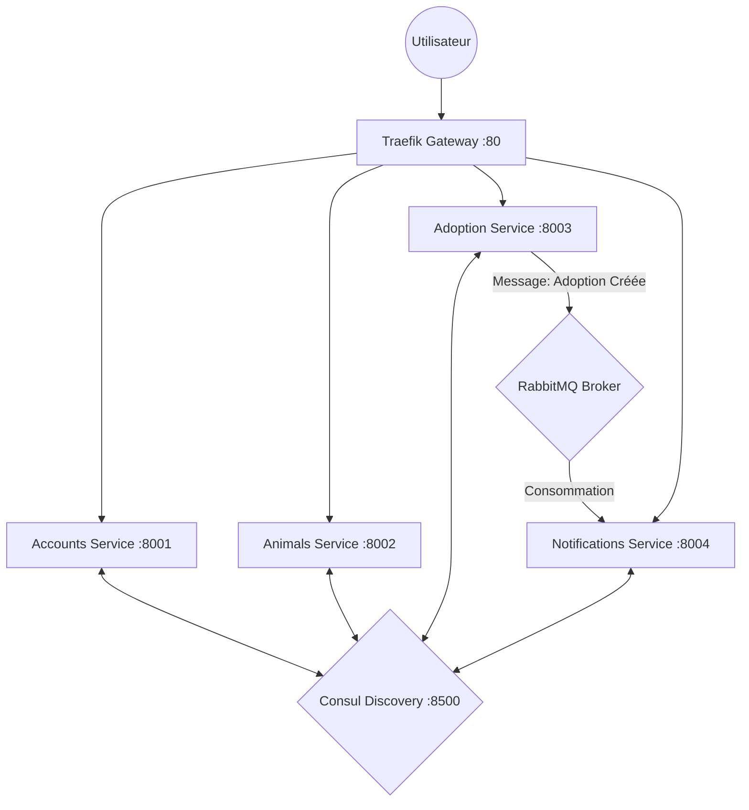

# 🐾 AdopAnimaux - Architecture Microservices

Une plateforme distribuée de gestion d'adoption d'animaux, conçue avec une architecture microservices moderne pour assurer la scalabilité, la résilience et une communication inter-services fluide.

---

## 🏗️ Architecture du Système

Le projet repose sur quatre microservices indépendants qui communiquent de manière synchrone (REST) et asynchrone (RabbitMQ), le tout orchestré par une passerelle API et un annuaire de services.

### 🧩 Composants Clés
- **Passerelle API (Traefik)** : Point d'entrée unique de l'application. Gère le routage dynamique vers les services via Consul.
- **Service Discovery (Consul)** : Annuaire central où chaque service s'enregistre dynamiquement.
- **Message Broker (RabbitMQ)** : Gère les événements asynchrones, notamment l'envoi de notifications lors d'une adoption.

### 🌐 Diagramme d'Architecture


---

## 🚀 Services & Fonctionnalités

| Service | Port | Description |
| :--- | :--- | :--- |
| **Accounts** | `8001` | Gestion des utilisateurs, Authentification JWT, Profils. |
| **Animals** | `8002` | Catalogue des animaux disponibles à l'adoption. |
| **Adoption** | `8003` | Gestion du processus d'adoption et émission d'événements. |
| **Notifications** | `8004` | Service d'alerte en temps réel pour les utilisateurs. |

---

## 🛠️ Installation & Démarrage (Local)

### 1. Prérequis
- Python 3.10+
- RabbitMQ lancé localement (port par défaut `5672`)
- Consul & Traefik (exécutables fournis dans `./bin`)

### 2. Configuration
Les services sont configurés pour s'enregistrer automatiquement sur `localhost` si la variable d'environnement `USE_LOCALHOST=true` est définie.

### 3. Lancement Rapide
1. **Lancer l'infrastructure** :
   ```powershell
   .\bin\consul.exe agent -dev
   .\bin\traefik.exe --configFile=treafik\traefik.yml
   ```
2. **Lancer les microservices (dans chaque dossier respectif)** :
   ```bash
   # Exemple pour Accounts
   cd accounts_service
   $env:USE_LOCALHOST="true"; python manage.py runserver 8001
   ```
3. **Lancer le consommateur de notifications** :
   ```bash
   cd notifications_service
   python manage.py run_consumer
   ```

---

## 📂 Structure du Projet
- `shared/` : Code partagé (client Consul common).
- `bin/` : Binaires pour l'infrastructure (Consul, Traefik).
- `treafik/` : Configuration de la gateway.
- `*_service/` : Répertoires des microservices Django.

---

## 👨‍🏫 Note pour l'Examen
Ce projet démontre la maîtrise des concepts suivants :
- **Routage Dynamique** avec Traefik.
- **Service Discovery** avec Consul.
- **Messaging Event-Driven** avec RabbitMQ & Pika.
- **Sécurisation** par Token JWT.
- **Centralisation** du code technique (DRY) via le module `shared`.

---
*Réalisé dans le cadre du projet Adoption Animaux.*